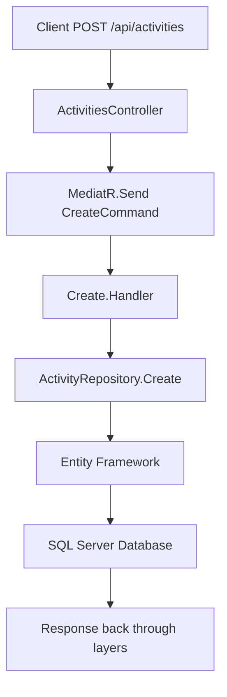

# Architecture Documentation

## Overview

Social Activities follows Clean Architecture principles with clear separation of concerns across multiple layers. This document provides detailed information about the architectural decisions and patterns used in the application.

## Clean Architecture Layers

### 1. Domain Layer
**Location**: `Domain/`
**Purpose**: Contains business entities, value objects, and core business logic
**Dependencies**: None (innermost layer)

**Key Components**:
- **Entities**: `Activity`, `AppUser`, `Comment`, `Photo`
- **Value Objects**: `CancelationValueObject`, `RefreshToken`
- **Interfaces**: Domain contracts and specifications

**Example Entity**:
```csharp
public class Activity
{
    public Guid Id { get; set; }
    public string Title { get; set; }
    public DateTime Date { get; set; }
    public string Description { get; set; }
    public string Category { get; set; }
    public string City { get; set; }
    public string Venue { get; set; }
    public string Creator { get; set; }
    
    // Business logic methods
    public void AddAttendee(AppUser user, bool isHost) { ... }
    public void UpdateAttendance(AppUser user) { ... }
    public void CancelActivity() { ... }
}
```

### 2. Application Layer
**Location**: `Application/`
**Purpose**: Contains application business logic, use cases, and orchestration
**Dependencies**: Domain layer only

**Key Components**:
- **Features**: Organized by domain area (Activities, Comments, Photos, etc.)
- **CQRS Pattern**: Commands and Queries using MediatR
- **DTOs**: Data Transfer Objects for API responses
- **Validators**: FluentValidation for input validation

**Feature Structure**:
```
Features/
├── Activities/
│   ├── Create.cs      # Command for creating activities
│   ├── List.cs        # Query for listing activities
│   ├── Detail.cs      # Query for activity details
│   └── Dtos/          # Data Transfer Objects
├── Comments/
├── Photos/
└── Profiles/
```

**Example Command**:
```csharp
public static class Create
{
    public record Command(ActivityRequest Activity) : IRequest<Result<Unit>>;
    
    public class CommandValidator : AbstractValidator<Command>
    {
        public CommandValidator()
        {
            RuleFor(x => x.Activity).SetValidator(new ActivityValidator());
        }
    }
    
    public class Handler : IRequestHandler<Command, Result<Unit>>
    {
        // Implementation
    }
}
```

### 3. Infrastructure Layer
**Location**: `Persistence/`
**Purpose**: Data access, external services, and infrastructure concerns
**Dependencies**: Domain and Application layers

**Key Components**:
- **DbContext**: Entity Framework configuration
- **Repositories**: Data access patterns
- **Migrations**: Database schema changes
- **Configurations**: Entity configurations

### 4. Presentation Layer
**Location**: `API/`
**Purpose**: API endpoints, authentication, and external interface
**Dependencies**: Application layer

**Key Components**:
- **Controllers**: REST API endpoints
- **SignalR Hubs**: Real-time communication
- **Middleware**: Cross-cutting concerns
- **Services**: Authentication, token management

## Design Patterns

### CQRS (Command Query Responsibility Segregation)
The application uses CQRS pattern through MediatR:

**Commands**: Operations that change system state
```csharp
public record CreateActivityCommand(ActivityRequest Activity) : IRequest<Result<Unit>>;
```

**Queries**: Operations that retrieve data
```csharp
public record GetActivitiesQuery() : IRequest<Result<List<ActivityResponse>>>;
```

### Repository Pattern
Data access is abstracted through repositories:
```csharp
public interface IActivityRepository
{
    Task<Activity> GetByIdAsync(Guid id);
    Task<List<Activity>> GetAllAsync();
    void Create(Activity activity);
    void Update(Activity activity);
    void Delete(Activity activity);
}
```

### Unit of Work Pattern
Coordinates multiple repository operations:
```csharp
public interface IUnitWork
{
    Task<bool> CommitSaveAsync();
}
```

### Dependency Injection
Services are registered using .NET's built-in DI container:
```csharp
builder.Services
    .AddApplication()
    .AddPersistence(builder.Configuration)
    .AddIdentityServices(builder.Configuration);
```

## Data Flow

### Request Processing Flow
1. **Client Request** → API Controller
2. **Controller** → MediatR Command/Query
3. **Handler** → Business Logic + Repository
4. **Repository** → Database via Entity Framework
5. **Response** ← DTOs mapped back to client

### Example Flow: Create Activity


## Security Architecture

### Authentication Flow
1. User credentials → AccountController
2. Validate with Identity → Generate JWT
3. JWT sent to client → Stored in localStorage
4. Subsequent requests → Authorization header
5. JWT validation → Access granted/denied

### Authorization Layers
- **Controller Level**: `[Authorize]` attributes
- **Policy Based**: Custom authorization policies
- **Resource Based**: Host-only operations

## Database Design

### Entity Relationships
- **Users** (1:N) **Activities** (through ActivityAttendee)
- **Activities** (1:N) **Comments**
- **Users** (1:N) **Photos**
- **Users** (M:N) **UserFollowing** (self-referencing)

### Database Context
```csharp
public class ActivityContext : IdentityDbContext<AppUser>
{
    public DbSet<Activity> Activities { get; set; }
    public DbSet<Comment> Comments { get; set; }
    public DbSet<Photo> Photos { get; set; }
    public DbSet<ActivityAttendee> ActivityAttendees { get; set; }
}
```

## Real-time Architecture

### SignalR Implementation
- **Hub**: `ChatHub` for real-time comments
- **Groups**: Activities as chat rooms
- **Client Connection**: Automatic group joining
- **Message Flow**: Client → Hub → MediatR → Database → All Clients

## Error Handling

### Exception Middleware
Global exception handling middleware catches and formats errors:
```csharp
public class ExceptionMiddleware
{
    public async Task InvokeAsync(HttpContext context, RequestDelegate next)
    {
        try
        {
            await next(context);
        }
        catch (Exception ex)
        {
            // Log and format error response
        }
    }
}
```

### Result Pattern
Consistent error handling using Result pattern:
```csharp
public class Result<T>
{
    public bool IsSuccess { get; set; }
    public T Value { get; set; }
    public string Error { get; set; }
    
    public static Result<T> Ok(T value) => new Result<T> { IsSuccess = true, Value = value };
    public static Result<T> Fail(string error) => new Result<T> { IsSuccess = false, Error = error };
}
```

## Frontend Architecture

### Component Structure
```
src/
├── app/
│   ├── components/      # Reusable UI components
│   ├── features/        # Feature-specific components
│   ├── stores/          # MobX state management
│   ├── services/        # API and utility services
│   └── layout/          # App layout components
```

### State Management with MobX
```typescript
class ActivityStore {
    activities: Activity[] = [];
    selectedActivity: Activity | null = null;
    
    @action
    loadActivities = async () => {
        const response = await agent.Activities.list();
        this.activities = response;
    }
}
```

## Performance Considerations

### Database Optimization
- **Lazy Loading**: Disabled for better control
- **Eager Loading**: Explicit Include() statements
- **Indexes**: Applied to frequently queried columns
- **Pagination**: Implemented for large datasets

### Caching Strategy
- **Client-side**: React component state and MobX stores
- **Server-side**: Can be extended with Redis/Memory caching

### API Optimization
- **Async/Await**: All async operations
- **Minimal APIs**: Lean controller methods
- **Compression**: Response compression enabled

## Testing Strategy

### Unit Testing
- **Domain Logic**: Test business rules and entities
- **Application Logic**: Test handlers and validators
- **Repositories**: Test data access patterns

### Integration Testing
- **API Endpoints**: Test complete request/response cycles
- **Database**: Test with in-memory or test database
- **Authentication**: Test security flows

## Monitoring and Logging

### Logging Strategy
- **Structured Logging**: Using built-in .NET logging
- **Application Insights**: For production monitoring
- **Error Tracking**: Exception logging and notification

### Health Checks
- **Database**: Connection health
- **External Services**: API availability
- **System Resources**: Memory and CPU usage

## Deployment Architecture

### Development Environment
- **Local Development**: SQL Server Express
- **Hot Reload**: dotnet watch, Vite dev server
- **CORS**: Configured for local development

### Production Environment
- **Database**: SQL Server or Azure SQL
- **Hosting**: Azure App Service, AWS, or on-premises
- **HTTPS**: SSL/TLS encryption
- **Load Balancing**: Multiple instance support

## Future Enhancements

### Scalability Improvements
- **Caching Layer**: Redis implementation
- **Database Sharding**: Horizontal scaling
- **Microservices**: Service decomposition
- **Event Sourcing**: Audit trail and event replay

### Security Enhancements
- **OAuth Integration**: Social login providers
- **Rate Limiting**: API throttling
- **Input Sanitization**: XSS prevention
- **API Versioning**: Backward compatibility

This architecture provides a solid foundation for a scalable, maintainable social activities platform while following industry best practices and clean code principles.